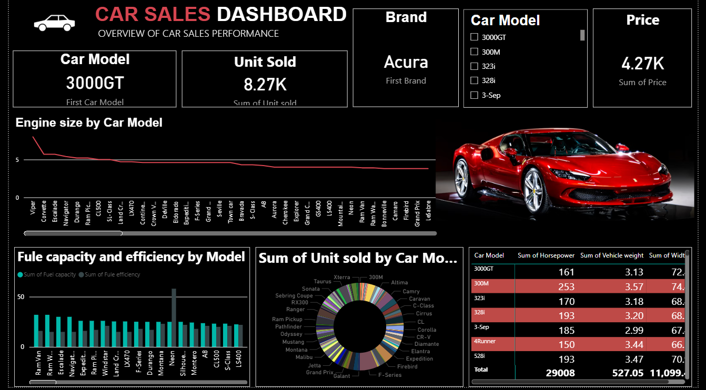
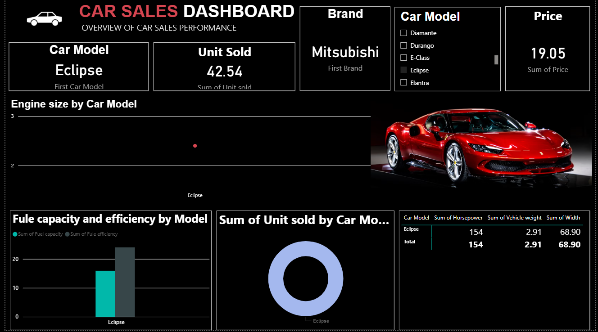
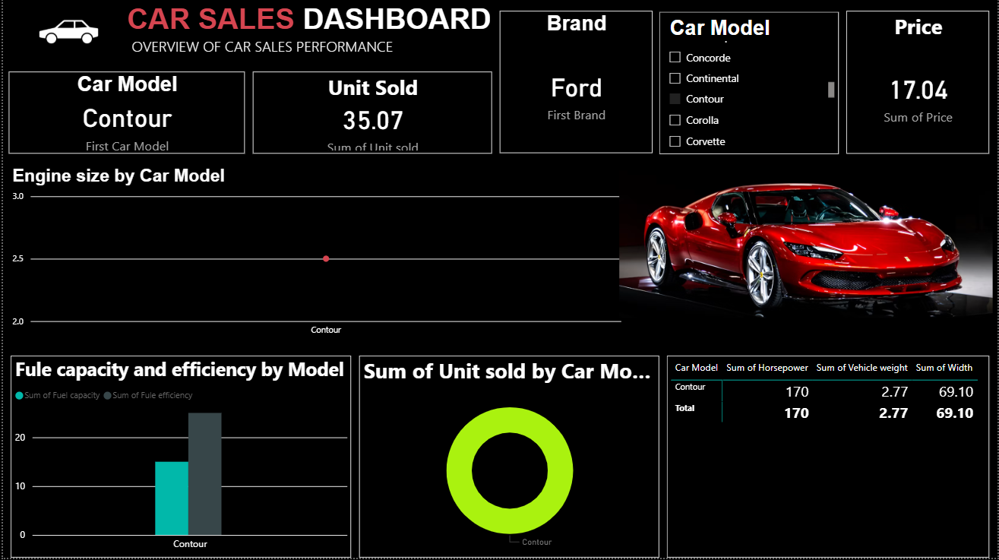

# 🚗 Car Sales Dashboard

## 📌 Project Overview

This project presents an interactive **Car Sales Dashboard** developed using **Power BI** to analyze vehicle sales and performance. The dashboard helps visualize key business metrics such as unit sales, pricing, engine specifications, fuel efficiency, and vehicle performance. It enables users to explore sales trends and compare different car models and brands through interactive filters and charts.

---

## 🎯 Objectives

* Analyze car sales performance across different brands and models.
* Compare engine size, fuel efficiency, and fuel capacity.
* Track unit sales and pricing information.
* Create an interactive dashboard for better business insights.

---

## 🛠️ Tools & Technologies

* **Power BI**
* **Microsoft Excel**
* **Python (Pandas)** – Data Cleaning & Preprocessing

---

## 📊 Dashboard Features

* KPI Cards for:

  * Car Model
  * Brand
  * Total Units Sold
  * Price
* Interactive Slicer for Car Model
* Engine Size Analysis by Car Model
* Fuel Capacity vs Fuel Efficiency Comparison
* Unit Sold Distribution by Car Model
* Detailed Performance Table including:

  * Horsepower
  * Vehicle Weight
  * Width

---

## 📈 Key Insights

* Compared sales performance across multiple car brands and models.
* Identified differences in engine size and fuel efficiency.
* Analyzed pricing and unit sales to understand product performance.
* Built interactive visualizations for faster decision-making.

---

## 📂 Project Structure

```text
Car-Sales-Dashboard
│
├── README.md
├── Car_Sales_Dataset.xlsx
├── Car_Sales_Dashboard.pbix
├── Car_Sales_Analysis.ipynb
│
└── Images
    ├── Dashboard.png
    └── Pivote tables.png
    └── Pivote charts.png
```

---

## Dashboard Preview




---

## 🚀 Skills Demonstrated

* Data Cleaning
* Data Analysis
* Dashboard Development
* KPI Design
* Interactive Reporting
* Data Visualization
* Business Intelligence
* Power BI
* Excel
* Python (Pandas)

---

## 📌 Future Enhancements

* Add DAX measures for advanced KPIs.
* Include sales trend analysis over time.
* Add forecasting and predictive analytics.
* Integrate real-time data sources.

---

## 

